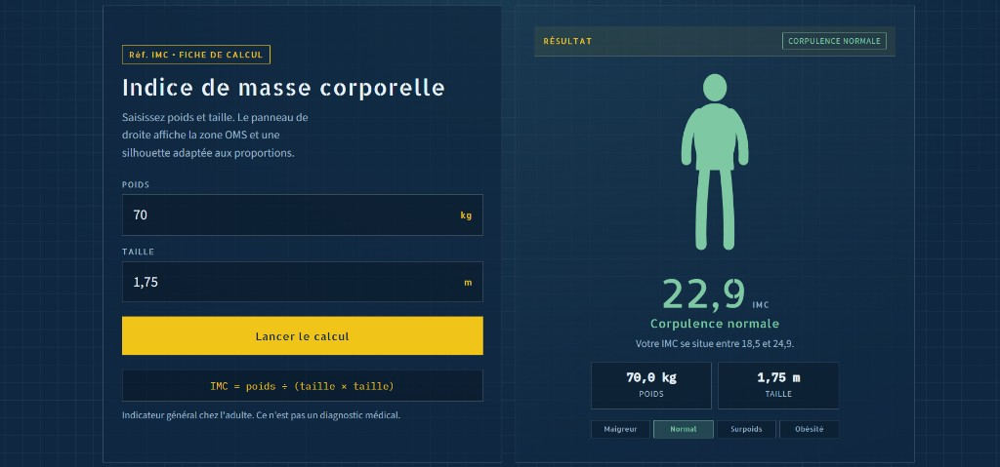

<div align="center">

# Calculateur d'IMC

**Fiche de calcul en deux colonnes — plan technique**

[](https://developer.mozilla.org/fr/docs/Web/HTML)
[](https://developer.mozilla.org/fr/docs/Web/CSS)
[](https://developer.mozilla.org/fr/docs/Web/JavaScript)
[](https://akieni.com)

</div>

---

## À propos

Projet **JavaScript** (Akieni Academy, Brazzaville).

Interface type plan technique : grille ardoise, accent jaune signal, typographie Allerta Stencil. À gauche la saisie (poids / taille), à droite le résultat (IMC, catégorie OMS, silhouette SVG, jauge). Pas de défilement sur ordinateur.

> HTML5 · CSS3 · JavaScript · formulaire · conditions · fonctions · DOM

## Aperçu



## Fonctionnalités

- Saisie du poids (kg) et de la taille (m)
- Calcul `IMC = poids ÷ (taille × taille)`
- Classification selon les seuils OMS
- Silhouette SVG adaptée à la catégorie
- Jauge des quatre catégories
- Layout fixe deux colonnes (PC) / empilement (mobile)

## Catégories

| IMC | Catégorie | Classe CSS |
|---|---|---|
| &lt; 18,5 | Maigreur | `.maigreur` |
| 18,5 – 24,9 | Normal | `.normal` |
| 25 – 29,9 | Surpoids | `.surpoids` |
| ≥ 30 | Obésité | `.obesite` |

## Lancer

```bash
cd "01_calculateur_imc"
```

Ouvrir `index.html` dans le navigateur (fonctionne aussi en `file://`).

## Utilisation

| Action | Résultat |
|---|---|
| Saisir poids et taille | Les champs acceptent les mesures |
| Cliquer sur **Lancer le calcul** | Le panneau droit affiche IMC, catégorie et silhouette |
| Modifier puis recalculer | Silhouette et jauge se mettent à jour |

## Structure

```text
01_calculateur_imc/
├── index.html
├── style.css
├── imc.js
├── preview.png
└── README.md
```

## Technologies

| Technologie | Utilisation |
|---|---|
| HTML5 | Formulaire et panneaux |
| CSS3 | Grille blueprint, variables, silhouette, jauge |
| JavaScript | Lecture des champs, calcul, affichage DOM |

## Contact

**MALONGA Saint Chalbhery** — [GitHub @Chal-B](https://github.com/Chal-B) — [LinkedIn](https://www.linkedin.com/in/saint-chalbhery-malonga-2784253b2) — saintmlg@icloud.com
